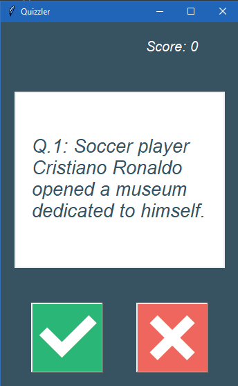
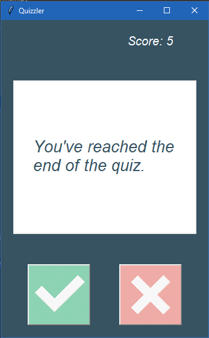

# Quizzler - Quiz APP
> You can check your knowledge through this app.

## Table of Contents
* [General Info](#general-information)
* [Technologies Used](#technologies-used)
* [Screenshots](#screenshots)
* [Contact](#contact)
<!-- * [License](#license) -->

## General Information
The purpose of creating this project is to consolidate what I learned so far.
<!-- You don't have to answer all the questions - just the ones relevant to your project. -->

## Technologies Used
- Python - 3.8

## Screenshots

## Contact
t.me/Ilkhomjoon - feel free to contact me!

<!-- Optional -->
<!-- ## License -->
<!-- This project is open source and available under the [... License](). -->

<!-- You don't have to include all sections - just the one's relevant to your project -->
