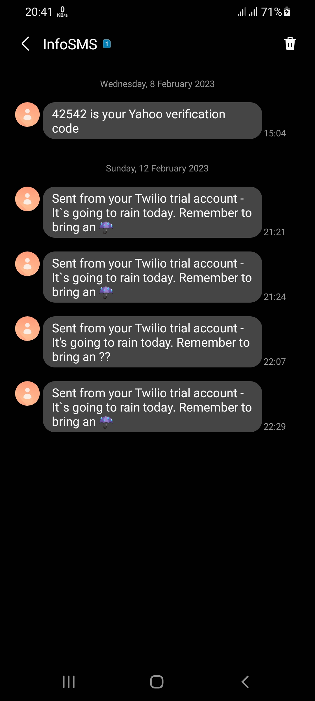

# RAIN ALERT
> This project's aim is to warn us before getting rains.

## Table of Contents
* [General Info](#general-information)
* [Technologies Used](#technologies-used)
* [Features](#features)
* [Screenshots](#screenshots)
* [Contact](#contact)

## General Information
- The project includes 12 hourly data from openweathermap.org and it takes hourly weather data after that it sends us an SMS message to phone number warning message about getting rain today.

## Technologies Used
- Python3 - 3.8
- Twilio
- pythonanywhere

## Features
- With help of this project you never leave your home without an umbrella because the project will warn you about it if rains.

## Screenshots

## Contact
t.me/Ilkhomjoon - feel free to contact me!

<!-- Optional -->
<!-- ## License -->
<!-- This project is open source and available under the [... License](). -->

<!-- You don't have to include all sections - just the one's relevant to your project -->
